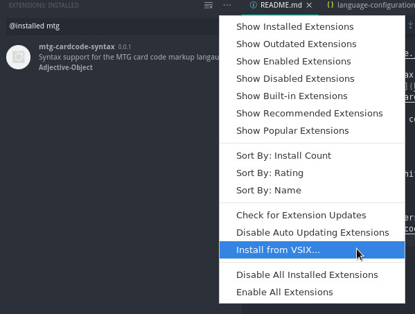

# mtg-cardcode-syntax

Adds an MTG cardcode syntax to `.mtgset` files, based on the markup described in the [Nuts & Bolts: Card Codes](https://magic.wizards.com/en/articles/archive/making-magic/nuts-bolts-card-codes-2009-01-12) blog post.

In addition to supporting colours for the base codes here, this extension set includes highlighting for

-   Card types
-   Leywords
-   Colours (W/U/B/R/G, White/Blue/Black/Red/Green)

## Installation

Download the latest version from [the releases page](https://github.com/Adjective-Object/mtg-cardcode-syntax/releases), and install it via

Extensions > The ... menu above extension search > Install from VSIX

